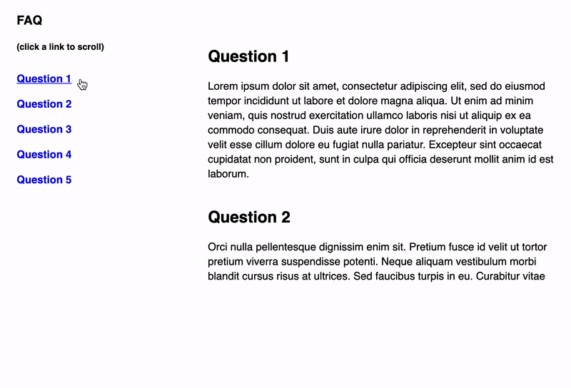

# React - Use Scroll to Element Hook

> React hook for scrolling to elements on the same page (Anchor Link)

<br/>

[](https://www.npmjs.com/package/react-use-scroll-to-element-hook) [](https://standardjs.com)

<br/>

## Installation

This module is distributed via npm which is bundled with node and
should be installed as one of your project's dependencies:

```shell
npm install --save react-use-scroll-to-element-hook
```

<br/>

## Demo

> ### [https://codesandbox.io/s/react-use-scoll-to-element-hook-example-1kids](https://codesandbox.io/s/react-use-scoll-to-element-hook-example-1kids)

<br/>
<br/>



<br/>
<br/>

## Usage

```js
import React from 'react';
import ReactDOM from 'react-dom';
import { useScrollToElement } from 'react-use-scroll-to-element-hook';

function MyComponent() {
  // some code...

  const FAQS = [
    {
      name: 'Question 1',
      answer: 'Lorem ipsum',
    },
    {
      name: 'Question 2',
      Ananswerswer: 'Pretium fusce id ',
    },
    {
      name: 'Question 3',
      answer: 'Dolor sit amet',
    },
  ];

  const faqNames = FAQS.map(faq => faq.name);

  //Refer to: https://developer.mozilla.org/en-US/docs/Web/API/Element/scrollIntoView
  const scrollIntoViewOptions = {
    behavior: 'auto';
  }

  const { getScrollToElementRef, scrollToElementClickHandler } = useScrollToElement(
    faqNames, //array of strings
    scrollIntoViewOptions //this is optional - behavior: smooth is used by default
  );

  return <div>{/* render FAQ with Anchor links here - see CodeSandBox demo */}</div>;
}
```
